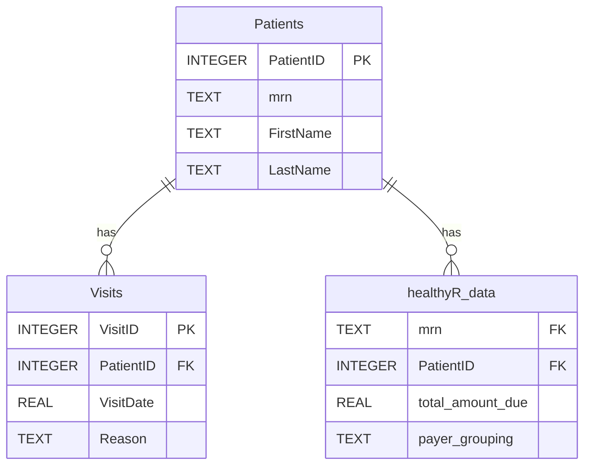

# SQL RAG Application User Guide

This guide provides comprehensive instructions for using the SQL RAG application in both **Demo** and **Production** environments. It includes setup steps, usage scenarios, example queries, and database diagrams.

## Table of Contents
1. [Demo Application](#demo-application)
    - [Setup & Running](#demo-setup--running)
    - [Database Schema (ERD)](#demo-database-schema-erd)
    - [Working Queries](#demo-working-queries)
2. [Production Application](#production-application)
    - [Configuration](#production-configuration)
    - [Running in Production](#running-in-production)
    - [Potential Queries](#production-potential-queries)
3. [Usage Scenarios](#usage-scenarios)

---

## Demo Application

The demo application uses a local SQLite database (`demo.db`) populated with synthetic healthcare data (`healthyR_data`). It is designed to showcase the Natural Language to SQL capabilities without requiring external database infrastructure.

### Demo Setup & Running

1.  **Prerequisites**: Ensure Python 3.10+ and `ollama` are installed.
2.  **Start the Application**:
    Run the PowerShell script:
    ```powershell
    .\run_demo.ps1
    ```
    *This script will automatically start the Ollama service if it is not running.*

3.  **Interact**:
    Wait for the `Enter your question (or 'exit' to quit):` prompt. Type your question in plain English.

### Demo Database Schema (ERD)

The demo database consists of three linked tables: `Patients`, `Visits`, and `healthyR_data`.



### Demo Working Queries

You can ask the following questions in the demo application:

1.  **Patient Volume**:
    > "How many patients are in the database?"
    *SQL*: `SELECT COUNT(*) FROM Patients;`

2.  **Financial Analysis**:
    > "What is the total amount due by payer grouping?"
    *SQL*: `SELECT payer_grouping, SUM(total_amount_due) FROM healthyR_data GROUP BY payer_grouping ORDER BY SUM(total_amount_due) DESC;`

3.  **Visit Frequency**:
    > "List the top 5 patients with the most visits."
    *SQL*: `SELECT p.FirstName, p.LastName, COUNT(v.VisitID) as VisitCount FROM Patients p JOIN Visits v ON p.PatientID = v.PatientID GROUP BY p.PatientID ORDER BY VisitCount DESC LIMIT 5;`

4.  **Clinical Data**:
    > "Show me the average length of stay for each service line."
    *SQL*: `SELECT service_line, AVG(length_of_stay) FROM healthyR_data GROUP BY service_line;`

---

## Production Application

The production application is designed to connect to an enterprise SQL Server (or other supported DB) and use a robust LLM hosting service.

### Production Configuration

1.  **Database Connection**:
    Edit `config/database.yaml` or set environment variables:
    - `DB_TYPE`: `sqlserver`
    - `DB_HOST`: Your SQL Server hostname
    - `DB_NAME`: Your production database name
    - `DB_USER` / `DB_PASSWORD`: Credentials

2.  **LLM Configuration**:
    Edit `config/ollama.yaml` to point to your production Ollama instance or compatible API:
    - `base_url`: `http://your-llm-server:11434`
    - `model`: Use a larger, more capable model like `sqlcoder-34b` or `gpt-4` (via proxy) for complex production schemas.

### Running in Production

Execute the main python script directly, ensuring your environment variables are set:

```powershell
# Example PowerShell command
$env:DB_TYPE='sqlserver'
$env:DB_HOST='prod-db.example.com'
python src/main.py
```

### Production Potential Queries

In a production environment (assuming a standard EMR schema), you might ask:

1.  **Revenue Cycle**:
    > "Identify all claims denied by Blue Cross in the last quarter."
    *SQL (T-SQL)*: `SELECT * FROM Claims WHERE Payer = 'Blue Cross' AND Status = 'Denied' AND Date >= DATEADD(quarter, -1, GETDATE());`

2.  **Population Health**:
    > "Find patients with HbA1c > 9.0 who haven't had a visit in 6 months."
    *SQL (T-SQL)*: `SELECT p.Name FROM Patients p JOIN Labs l ON p.ID = l.PatientID WHERE l.Test = 'HbA1c' AND l.Value > 9.0 AND p.LastVisitDate < DATEADD(month, -6, GETDATE());`

---

## Usage Scenarios

### Scenario 1: Financial Analyst
**Goal**: Analyze revenue leakage.
**Action**: Ask, "What is the total adjustment amount for 'Self Pay' patients?"
**Result**: The system queries the `healthyR_data` (or production billing table) to sum adjustments where payer is 'Self Pay', helping identify write-off magnitudes.

### Scenario 2: Clinical Operations Manager
**Goal**: Optimize bed utilization.
**Action**: Ask, "Which service line has the highest average length of stay?"
**Result**: The system aggregates `length_of_stay` by `service_line`, highlighting areas (e.g., 'General Medicine' vs 'Surgery') that might need process improvements.

### Scenario 3: Compliance Officer
**Goal**: Audit access or outliers.
**Action**: Ask, "List visits where the length of stay was an outlier."
**Result**: The system filters for `los_outlier_flag = 1`, providing a list of cases requiring audit review.

### Scenario 4: Patient Experience Coordinator
**Goal**: Understand patient demographics.
**Action**: Ask, "What is the breakdown of patients by gender?"
**Result**: The system counts patients grouped by the `Gender` column, providing a demographic snapshot to tailor services.
